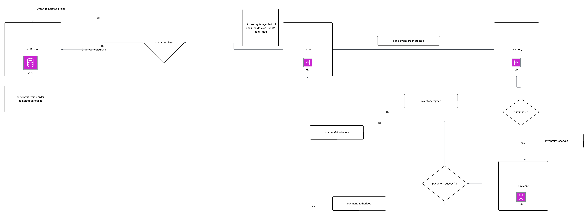

# Event-Driven Microservices System

This is a event-driven microservices system for a simplified e-commerce flow (Orders -> Inventory -> Payments -> Notifications) built using Spring Boot and Kafka.
It demonstrates the use of event-driven architecture in a microservices environment.

## Event-Driven Workflow Overview

This system simulates an **order processing pipeline** using an event-driven microservices architecture with Kafka.

### Event Flow

1. ### **Order Creation**
    - The **Order Service** creates a new order.
    - It **publishes an `OrderCreated` event** to Kafka.

2. ### **Inventory Check**
    - The **Inventory Service** consumes the `OrderCreated` event.
    - It attempts to **reserve stock** for the items in the order.
        - If stock is available, it publishes an `InventoryReserved` event.
        - If stock is insufficient, it publishes an `InventoryRejected` event.

3. ### **Payment Processing**
    - The **Payment Service** listens for `InventoryReserved` events.
    - It simulates payment logic and:
        - Publishes `PaymentAuthorized` on success.
        - Publishes `PaymentFailed` or `PaymentRejected` on failure.

4. ### **Order Finalization**
    - The **Order Service** listens for `PaymentAuthorized`, `PaymentFailed`, and `InventoryRejected`.
    - Based on the events, it transitions the order status:
        - `COMPLETED` if payment succeeds.
        - `CANCELLED` if payment fails or inventory is rejected.

5. ### **Customer Notification**
    - The **Notification Service** listens for:
        - `OrderCompleted`
        - `OrderCancelled`
    - It then **emits a notification** to the customer (e.g. console log).

----



## Prerequisites


- Java 21 or higher
- Maven 3.6 or higher
- Docker and Docker Compose
- PostgreSQL 15 or higher
- Kafka 7.5 or higher

## How to run

1. Clone the repository
2. Build the project using Maven
3. Run the docker-compose.yml file
4. Start the services using the following command:
   ```
   docker-compose up
   ```
5. Access the services using the following URLs:
   >Create Order:
   >> http://localhost:8080/orders

   RequestBody
    ```
   {
   "customerId": "123e4567-e89b-12d3-a456-427714174000",
   "items": [{"sku":"monitor","qty":1,"price":2000.0},{"sku":"book","qty":2,"price":100.0}]
   }
   ```
   > 
   > Get Order:
   >> http://localhost:8080/orders/{orderId}
   